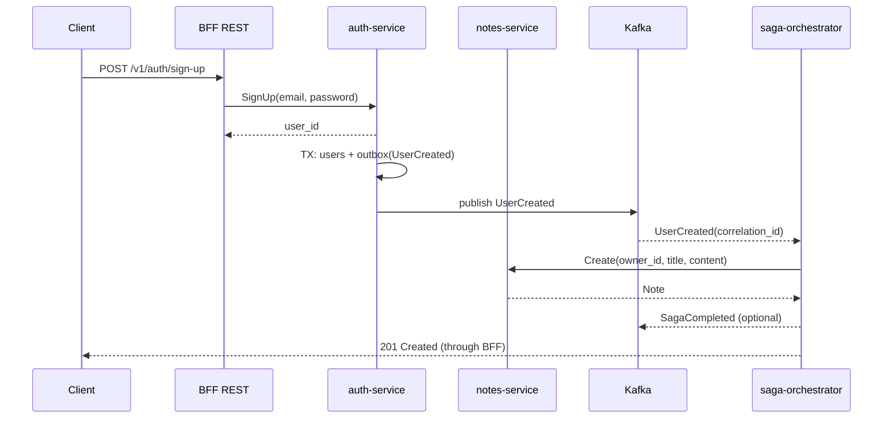

# Архитектура: сервисы, данные, контракты и взаимодействие

Документ описывает модель данных (PostgreSQL), контракты gRPC, события Kafka (Outbox), а также схему взаимодействия между сервисами и BFF.

## Обзор домена и сервисов

- auth-service: регистрация, аутентификация, управление токенами JWT; публикует события пользователя.
- notes-service: CRUD заметок, привязка заметки к `owner_id` (пользователь); публикует события заметок.
- saga-orchestrator: оркестровка саг (например, SignUpSaga), управление шагами, корреляцией и компенсациями.
- bff-rest: внешний REST API; выполняет аутентификацию по JWT, маршрутизирует запросы к gRPC сервисам.

## Модель данных (PostgreSQL)

Каждый сервис владеет своей БД (или схемой), связь — через события и gRPC.

### auth-service

```sql
CREATE TABLE users (
  id UUID PRIMARY KEY,
  email TEXT NOT NULL UNIQUE,
  pass_hash TEXT NOT NULL,
  created_at TIMESTAMPTZ NOT NULL DEFAULT now()
);

-- Таблица outbox для событий домена auth
CREATE TABLE outbox (
  id UUID PRIMARY KEY,
  aggregate_id TEXT NOT NULL,
  type TEXT NOT NULL,
  payload BYTEA NOT NULL,
  occurred_at TIMESTAMPTZ NOT NULL DEFAULT now(),
  sent_at TIMESTAMPTZ NULL,
  correlation_id TEXT NULL
);
CREATE INDEX idx_auth_outbox_sent_at ON outbox (sent_at);
```

### notes-service

```sql
CREATE TABLE notes (
  id UUID PRIMARY KEY,
  owner_id UUID NOT NULL,
  title TEXT NOT NULL,
  content TEXT NOT NULL,
  created_at TIMESTAMPTZ NOT NULL DEFAULT now(),
  updated_at TIMESTAMPTZ NOT NULL DEFAULT now(),
  deleted_at TIMESTAMPTZ NULL
);

-- Таблица outbox для событий домена notes
CREATE TABLE outbox (
  id UUID PRIMARY KEY,
  aggregate_id TEXT NOT NULL,
  type TEXT NOT NULL,
  payload BYTEA NOT NULL,
  occurred_at TIMESTAMPTZ NOT NULL DEFAULT now(),
  sent_at TIMESTAMPTZ NULL,
  correlation_id TEXT NULL
);
CREATE INDEX idx_notes_outbox_sent_at ON outbox (sent_at);
```

### saga-orchestrator

```sql
CREATE TABLE sagas (
  id UUID PRIMARY KEY,
  name TEXT NOT NULL,
  state TEXT NOT NULL,
  step INT NOT NULL,
  correlation_id TEXT NOT NULL,
  updated_at TIMESTAMPTZ NOT NULL DEFAULT now()
);

CREATE UNIQUE INDEX uq_sagas_correlation ON sagas (correlation_id);
```

## Контракты gRPC (protobuf)

Ниже — минимальные контракты, используемые сервисами. Фактические .proto файлы предполагаются в каталоге `proto/`.

### AuthService

```proto
syntax = "proto3";
package auth.v1;
option go_package = "github.com/your-org/notes/proto/gen/go/auth/v1;authv1";

service AuthService {
  rpc SignUp (SignUpRequest) returns (SignUpResponse);
  rpc SignIn (SignInRequest) returns (SignInResponse);
  rpc ValidateToken (ValidateTokenRequest) returns (ValidateTokenResponse);
}

message SignUpRequest { string email = 1; string password = 2; }
message SignUpResponse { string user_id = 1; }
message SignInRequest { string email = 1; string password = 2; }
message SignInResponse { string access_token = 1; string refresh_token = 2; }
message ValidateTokenRequest { string token = 1; }
message ValidateTokenResponse { string user_id = 1; bool valid = 2; }
```

### NotesService

```proto
syntax = "proto3";
package notes.v1;
option go_package = "github.com/your-org/notes/proto/gen/go/notes/v1;notesv1";

service NotesService {
  rpc Create (CreateNoteRequest) returns (Note);
  rpc Get    (GetNoteRequest) returns (Note);
  rpc List   (ListNotesRequest) returns (ListNotesResponse);
  rpc Update (UpdateNoteRequest) returns (Note);
  rpc Delete (DeleteNoteRequest) returns (DeleteNoteResponse);
}

message Note {
  string id = 1;
  string owner_id = 2;
  string title = 3;
  string content = 4;
  int64 created_at = 5;
  int64 updated_at = 6;
}
message CreateNoteRequest { string owner_id = 1; string title = 2; string content = 3; }
message GetNoteRequest { string id = 1; }
message ListNotesRequest { string owner_id = 1; int32 page = 2; int32 page_size = 3; }
message ListNotesResponse { repeated Note items = 1; int32 total = 2; }
message UpdateNoteRequest { string id = 1; string title = 2; string content = 3; }
message DeleteNoteRequest { string id = 1; }
message DeleteNoteResponse { bool ok = 1; }
```

## События, Kafka и Outbox

Обмен событиями осуществляется через Kafka. Каждый сервис записывает событие в свою таблицу `outbox` в рамках БД-транзакции, а фоновый ретранслятор надёжно публикует его в Kafka.

### Темы Kafka

- `auth.events`: события домена auth (например, `UserCreated`).
- `notes.events`: события домена notes (например, `NoteCreated`).
- `saga.commands`: команды от оркестратора к исполнителям (опционально).
- `saga.replies`: ответы исполнителей оркестратору (опционально).
- `dlq`: очередь для несериализуемых/необрабатываемых сообщений.

### Формат событий (envelope + payload)

```proto
syntax = "proto3";
package common.v1;
option go_package = "github.com/your-org/notes/proto/gen/go/common/v1;commonv1";

message EventEnvelope {
  string event_id = 1;        // UUID
  string aggregate_id = 2;    // user_id / note_id
  string type = 3;            // e.g. "auth.UserCreated"
  int64  occurred_at = 4;     // unix millis
  bytes  payload = 5;         // marshaled event (protobuf)
  string correlation_id = 6;  // saga id
}

message UserCreated { string user_id = 1; string email = 2; }
message NoteCreated { string note_id = 1; string owner_id = 2; }
```

### Идемпотентность

- Ключ сообщения: `event_id` (и/или `aggregate_id`).
- Консюмер хранит `processed_event_id` (например, в таблице или key-value) и пропускает повторы.
- Ретранслятор помечает записи в outbox полем `sent_at` только после подтверждённой отправки.

## Сага: пример SignUpSaga

Цель: при успешной регистрации создать пользователю welcome-заметку; при неудаче — выполнить компенсацию.

### Шаги

1. BFF принимает `POST /v1/auth/sign-up`.
2. BFF вызывает `AuthService.SignUp` → создаётся пользователь, в outbox пишется `UserCreated`.
3. Ретранслятор auth публикует `UserCreated` в `auth.events` (с `correlation_id`).
4. Orchestrator потребляет `UserCreated`, создаёт запись в `sagas`, шлёт команду создать заметку:
   - либо gRPC вызов `NotesService.Create`,
   - либо публикация команды в `saga.commands`.
5. При успехе — помечает сагу завершённой; при ошибке — вызывает компенсацию (например, `AuthService.DeleteUser`).

### Диаграмма взаимодействия (mermaid)



## REST BFF: публичные маршруты

- POST /v1/auth/sign-up → AuthService.SignUp
- POST /v1/auth/sign-in → AuthService.SignIn
- GET /v1/notes → NotesService.List (из JWT берётся `user_id`)
- POST /v1/notes → NotesService.Create
- GET /v1/notes/{id} → NotesService.Get
- PUT /v1/notes/{id} → NotesService.Update
- DELETE /v1/notes/{id} → NotesService.Delete

## Связи между компонентами

- BFF ↔ gRPC сервисы (Auth, Notes) по внутренней сети.
- Сервисы → Kafka для публикации событий через outbox.
- Orchestrator ↔ Kafka для потребления событий и/или отправки команд.
- Orchestrator ↔ gRPC сервисы для выполнения шагов и компенсаций.

## Наблюдаемость (коротко)

- Трассировка: контекст trace передаётся BFF → gRPC → Kafka headers → Orchestrator.
- Метрики: счётчики запросов/ошибок, latency, потребление/лаг Kafka, размер outbox.
- Логи: корреляция по `trace_id`/`span_id`/`correlation_id`.


